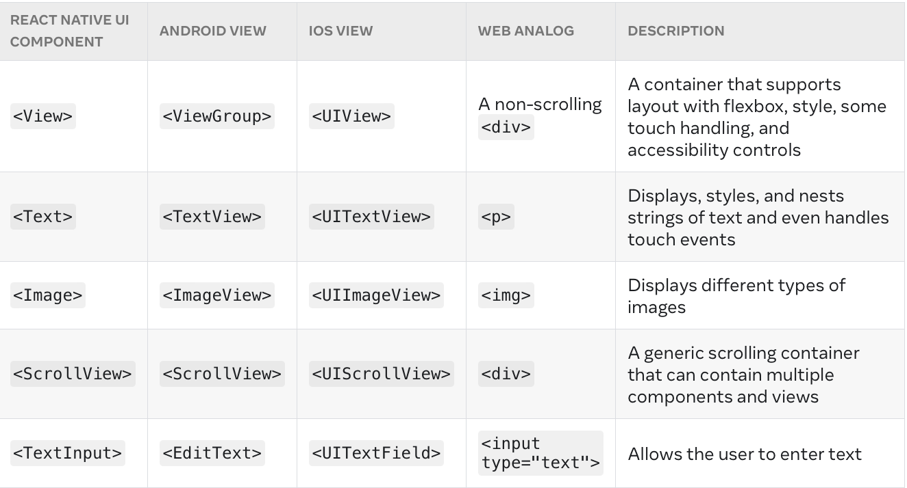

## React Native Basics

### Views and mobile development

### Core Components
React Native comes with a set of essential, ready-to-use Native Components you can use to start building your app today. These are React Native's Core Components.

A [complete list of core components](https://reactnative.dev/docs/components-and-apis) can be found

